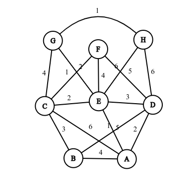
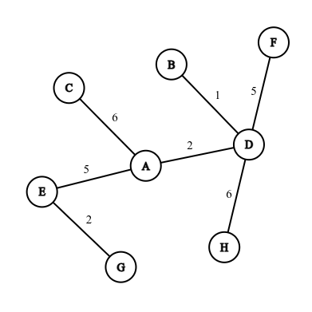

### README

# Projeto Grafo - Análise de Redes

Este projeto implementa um grafo com várias funcionalidades para análise de redes, incluindo a leitura de dados de um arquivo CSV e a execução de comandos para exibir informações sobre o grafo. O grafo é representado por vértices e arestas, cada uma com pesos associados.

## Descrição do Projeto

Este sistema permite a análise de redes por meio de um grafo direcionado ou não-direcionado, com ponderação de arestas. Ele oferece uma série de funcionalidades para análise de redes, incluindo a determinação de métricas como densidade, centralidade de grau e proximidade, e a execução do algoritmo de Dijkstra para encontrar o caminho mais curto entre dois vértices.

## Formato do Arquivo CSV

O arquivo CSV deve conter as arestas do grafo, onde cada linha representa uma aresta no formato:

```
Vertice1 Vertice2 peso
```

Exemplo:

```
Ana Bruno 4
Ana Carla 6
Ana Daniel 2
Ana Elisa 5
Bruno Carla 3
Bruno Daniel 1
Hugo Elisa 6
Carla Gabriela 4
Carla Elisa 2
Carla Fernando 1
Daniel Elisa 3
Daniel Fernando 5
Daniel Hugo 6
Elisa Fernando 4
Elisa Gabriela 2
Hugo Gabriela 1
```

## Compilação

Para compilar o projeto, você pode usar um compilador C++ como `g++`. Execute o seguinte comando para compilar todos os arquivos:

```sh
g++ -o grafo main.cpp grafo.cpp
```

## Execução

O programa aceita comandos de menu por meio de argumentos de linha de comando ou pode funcionar em modo interativo. O formato de execução é:

```sh
./grafo <nomeArquivoCSV> [comando]
```

### Comandos Disponíveis

- `1`: Exibir a lista de enlaces e respectivos pesos existentes no grafo.
- `2`: Exibir a densidade do grafo.
- `3`: Exibir o vértice com maior centralidade de grau.
- `4`: Exibir (Algoritmo de Dijkstra).
- `5`: Exibir o vértice com maior centralidade de proximidade.
- `0`: Sair.


## Funcionalidades

### Ler Arquivo CSV

A função `lerCSV` lê os dados do arquivo CSV, cria os vértices e arestas, e os adiciona ao grafo:


### Liberação de Memória

Após a execução, o programa libera a memória alocada para os vértices e o grafo:

```cpp
for (auto& par : mapaVertices) {
    delete par.second;
}
delete grafo;
```

### Como funciona o Dijkstra?

O algoritmo de Dijkstra encontra o caminho mais curto entre dois vértices em um grafo com arestas de pesos não negativos. Ele começa definindo a distância do vértice de origem como zero e todas as outras como infinitas. Utilizando uma fila de prioridade, ele explora o vértice com a menor distância, atualizando as distâncias dos vizinhos se um caminho mais curto for encontrado. O processo continua até que todos os vértices tenham sido processados ou o destino seja alcançado. Este algoritmo é eficiente e amplamente utilizado em sistemas de navegação e redes de comunicação.

| Vértice 1 | Vértice 2 | Peso |            
|-----------|-----------|------|
| Elisa     | Gabriela  | 2    |
| Daniel    | Hugo      | 6    |
| Daniel    | Fernando  | 5    |
| Ana       | Elisa     | 5    |
| Ana       | Daniel    | 2    |
| Ana       | Carla     | 6    |
| Bruno     | Daniel    | 1    |


#### Grafo original
 

#### Grafo de Custo Mínimo



Obs: Lembrando que cada letra nos exemplos é a inicial dos alunos listados.

---
## Exemplo de Uso

Ao executar o programa, o usuário verá um menu com as opções descritas acima. Selecionando uma das opções, o programa realizará a tarefa correspondente e exibirá os resultados no console.

## Autor

- **Nome:** Natália
- **Contato:** <natalia.carvalhinha@poli.ufrj.br>


